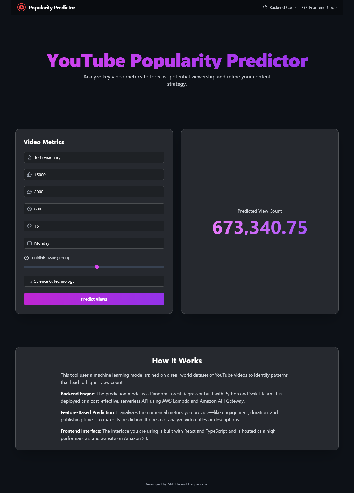

# Frontend for YouTube Popularity Predictor


This repository contains the source code for a modern, responsive, and visually stunning frontend application built to interface with the [AWS Serverless YouTube Popularity Predictor](https://github.com/MdEhsanulHaqueKanan/aws-serverless-youtube-predictor) backend.

**► Live Demo:** [http://youtube-predictor-frontend-ehsanul-72525.s3-website-us-east-1.amazonaws.com/](http://youtube-predictor-frontend-ehsanul-72525.s3-website-us-east-1.amazonaws.com/)

---

## 📸 Application Preview



## ✨ Key Features

- **Sleek, Professional UI:** A modern dark theme with a "glassmorphism" aesthetic for a premium user experience.
- **Interactive Data Input:** User-friendly components like sliders and styled dropdowns make entering video metrics intuitive.
- **Real-time API Integration:** Seamlessly connects to the serverless AWS backend to fetch live predictions from the machine learning model.
- **Dynamic Feedback:** Provides clear loading and error states to keep the user informed during the analysis process.
- **Fully Responsive:** The design is optimized for a seamless experience on both desktop and mobile devices.

## 🛠️ Tech Stack

- **Framework:** React
- **Language:** TypeScript
- **Build Tool:** Vite
- **Styling:** Tailwind CSS
- **Deployment & Hosting:** AWS S3 (Static Website Hosting)

## 🔗 Connecting to the Backend

This is a purely frontend application designed to work with its serverless counterpart. The backend is a complete MLOps project that serves a machine learning model via AWS Lambda and API Gateway.

- **Backend Code Repository:** [https://github.com/MdEhsanulHaqueKanan/aws-serverless-youtube-predictor](https://github.com/MdEhsanulHaqueKanan/aws-serverless-youtube-predictor)

## 🚀 Getting Started & Local Development

To run this project on your local machine, follow these steps.

### Prerequisites

- Node.js (v18 or later)
- npm or yarn

### Setup and Running

1.  **Clone the repository:**
    ```bash
    git clone https://github.com/MdEhsanulHaqueKanan/youtube-predictor-frontend.git
    cd youtube-predictor-frontend
    ```

2.  **Install dependencies:**
    ```bash
    npm install
    ```

3.  **Connect to the API Endpoint:**
    This frontend needs to know where to send its prediction requests.
    - Open the `src/components/Predictor.tsx` file.
    - Locate the `apiEndpoint` constant inside the `handleSubmit` function.
    - Replace the URL with the "Invoke URL" of your deployed Amazon API Gateway stage.

4.  **Run the development server:**
    ```bash
    npm run dev
    ```
    The application will now be running on `http://localhost:5173`.

5.  **Build for production:**
    To create the optimized static files for deployment, run:
    ```bash
    npm run build
    ```
    The output will be placed in the `dist` folder.

